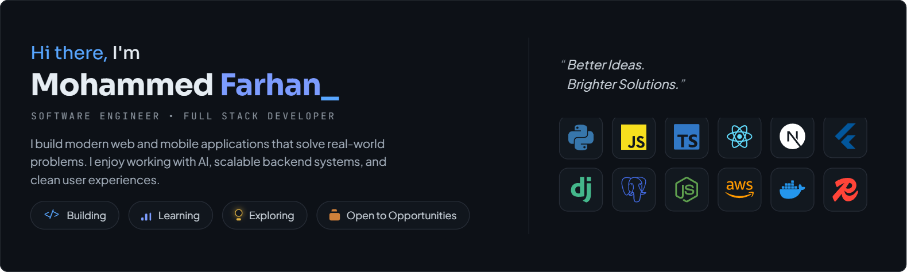

  

<h2>MISSION TELEMETRY</h2>

<table>
  <tr>
    <td align="center">
      <h3>💻</h3>
      <strong>500+</strong> 
      Commits
    </td>
    <td align="center">
      <h3>⭐</h3>
      <strong>10+</strong> 
      Stars
    </td>
    <td align="center">
      <h3>🔀</h3>
      <strong>20+</strong> 
      Pull Requests
    </td>
    <td align="center">
      <h3>🐛</h3>
      <strong>5+</strong> 
      Issues
    </td>
    <td align="center">
      <h3>📦</h3>
      <strong>14</strong> 
      Repositories
    </td>
  </tr>
</table>
